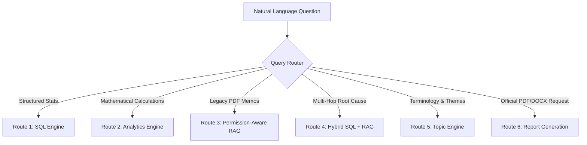

# ⛏️ GeoVault AI
### AI-Powered Geological, Mining, and Operational Reporting Solution for CMPDI/CIL Subsidiaries
**Smart India Hackathon 2026 — Problem Statement 26023**

---

## 📌 Executive Overview

**GeoVault AI** is a permission-aware, evidence-grounded, organization-controlled AI intelligence and reporting platform engineered specifically for the Coal India Limited (CIL) and Central Mine Planning & Design Institute (CMPDI) operational ecosystem.

Unlike generic conversational chatbots that suffer from hallucinations, data leakage, and silent mathematical errors, GeoVault AI strictly enforces:

```text
Identity
   ↓
Authorization (RBAC + ABAC)
   ↓
Authorized Retrieval Boundary
   ↓
Deterministic SQL / Scoped Vector Retrieval
   ↓
Evidence & Traceability Engine
   ↓
Mathematical Validation & Conflict Detection
   ↓
Local LLM Synthesis (Qwen3-8B On-Premises)
   ↓
Grounded Executive Narrative & Verified Boardroom Reports
```

---

## 🏛️ System Architecture

GeoVault AI operates as an entirely self-contained, air-gapped container cluster managed via **Docker Compose**:

```text
                              ┌────────────────────────────────────────┐
                              │     Next.js 14 Dashboard (:3000)       │
                              │ React 18 · Tailwind · Plotly · TS      │
                              └───────────────────┬────────────────────┘
                                                  │ X-User-ID / JSON
                                                  ▼
                              ┌────────────────────────────────────────┐
                              │      FastAPI Backend (:8000)           │
                              │ Security · Router · Analytics · Engine │
                              └──────────┬─────────────────┬───────────┘
                                         │                 │
              ┌──────────────────────────┼─────────────────┼──────────────────────────┐
              │                          │                 │                          │
              ▼                          ▼                 ▼                          ▼
┌───────────────────────────┐ ┌────────────────────┐ ┌───────────┐ ┌───────────────────────────┐
│       PostgreSQL 16       │ │     llama.cpp      │ │  Redis 7  │ │       Celery Worker       │
│  pgvector (1024-dim BGE)  │ │   Qwen3-8B GGUF    │ │  Broker   │ │ Asynchronous Reporting    │
│ Normalized Master Tables  │ │  Local Reasoner    │ │ & Cache   │ │ & Document Ingestion      │
└───────────────────────────┘ └────────────────────┘ └───────────┘ └───────────────────────────┘
```

### Microservice Topology

| Container Name | Service | Technology Stack | Port | Primary Responsibility |
|---|---|---|---|---|
| `geovault_frontend` | Frontend | Next.js 14, React 18, Tailwind CSS, Plotly.js | `3000` | Boardroom dashboard, query interface, word cloud, report downloads |
| `geovault_backend` | Backend API | FastAPI, Python 3.12, SQLAlchemy 2.0, Pydantic v2 | `8000` | Centralized RBAC/ABAC, query routing, deterministic analytics, validation |
| `geovault_postgres`| Database | PostgreSQL 16 + pgvector | `5432` | Relational master data, operational logs, 1024-dim BGE-M3 embeddings |
| `geovault_redis` | Cache & Broker | Redis 7 Alpine | `6379` | Query caching, Celery task broker, result backend |
| `geovault_llm` | Local Reasoner | llama.cpp server, Qwen3-8B-Q4_K_M GGUF | `8080` | Air-gapped on-premises natural language synthesis and summarization |
| `geovault_worker` | Async Worker | Celery 5.4, Python 3.12 | — | Background report compilation, OCR processing, vector embedding |

---

## 🔒 Security Architecture: Authorization Before Retrieval

A fundamental vulnerability of naive RAG architectures is retrieving all matching documents across the enterprise and filtering afterward, or worse, relying on prompt engineering to enforce privacy. 

In GeoVault AI:
1. **The LLM is NEVER the security boundary.**
2. **The Centralized `AuthorizationService` is the security boundary.**
3. **Retrieval is mathematically constrained before execution**:
   - Structured SQL queries append mandatory `WHERE mine_code IN (...)` clauses based on the user's active scope.
   - Vector similarity searches (`<=>`) execute pre-filtered SQL where chunks are filtered by `mine_code` and `classification <= user_clearance` **before** cosine distances are calculated.
   - Numerical aggregations (`SUM`, `AVG`) operate exclusively over authorized mines to eliminate indirect leakage.
   - Any attempt to query outside permitted boundaries immediately triggers **`HTTP 403 Forbidden`**, preventing unauthorized data from ever entering vector caches or LLM prompt contexts.

### Clearance Hierarchy & Role Matrix

```text
Classification Rank: PUBLIC (0) < INTERNAL (1) < RESTRICTED (2) < CONFIDENTIAL (3)
```

| Demo User | Role | Department | Clearance Level | Permitted Mines | Primary Function |
|---|---|---|---|---|---|
| **`USR001`** | Mining Engineer | Operations | `INTERNAL` | `DEOM-01` | Dharani East opencast mining and daily production queries |
| **`USR002`** | Geology Engineer | Exploration | `RESTRICTED` | `DEOM-01` | Seam thickness, geotechnical fault logs, strata risk analysis |
| **`USR003`** | Transportation Engineer | Logistics | `INTERNAL` | `KNUG-02` | Koyna North rail/road dispatch metrics and turnaround times |
| **`USR004`** | Mine Manager | Executive | `RESTRICTED` | `DEOM-01`, `KNUG-02` | Multi-mine operational benchmarking and target tracking |
| **`USR005`** | Administrator | HQ Executive | `CONFIDENTIAL` | `ALL` (Enterprise) | National statutory compliance, conflict audits, board reports |

> **SIH Evaluation Notice**: The frontend identity switcher is designed strictly for evaluation and judge demonstrations. In enterprise deployment, employee identity and clearance attributes are provisioned via Corporate SSO (SAML 2.0 / OIDC / CAC) and injected by the API gateway.

---

## 📊 Authoritative Data Layer (`Coal Data/`)

The authoritative source directory `Coal Data/` is mounted strictly as **`READ-ONLY` (`:ro`)**. Across all pipeline executions, zero source files are modified, moved, renamed, or deleted.

### Data Corpus Composition (32 Files Total)
1. **Operational Synthetic Corpus (20 files)**:
   - `mine_master.csv`: Canonical master records for Dharani East (`DEOM-01`), Koyna North (`KNUG-02`), and Satpura South (`SSOP-03`).
   - `production/`, `targets/`, `monthly/`: 5-year operating records (FY2021–FY2025; 15 annual rows, 180 monthly rows).
   - `dispatch/`, `quality/`, `geology/`, `issues/`, `inspections/`: Relational domain records covering logistics, coal quality (ash, moisture), strata geomechanics, operational incident logs, and statutory safety inspections.
   - `parliamentary/parliamentary_qa.csv`: Golden benchmark questions and reference answers for validation.
   - `legacy_pdfs/`: 8 legacy operational memos (pit flooding, fault encounters, water ingress, equipment wear) + 1 synthetic OCR text extract.
2. **Official Macro-Level Corpus (12 files)**:
   - `Official Data/Annual_Coal_Production.csv` & `Coal-Production-of-Captive-and-Commercial-Coal-Mines.csv`: Macroeconomic national totals (FY2014–FY2025).
   - `Official Data/cdchap1.xlsx` through `cdchap5.xlsx`: 5 multi-sheet CCO Coal Directory workbooks (~102 statistical sheets).
   - `Official Data/*.pdf`: 5 national publications from the Coal Controller's Organisation (CCO), Ministry of Coal (MoC), and Geological Survey of India (GSI).

---

## ⚡ Query Intelligence & Multi-Route Intent Router

Natural-language queries submitted by authorized employees are deterministically classified into one of 6 operational execution routes:



* **`SQL`**: Queries directly for factual column values (e.g. *"What was DEOM-01 production in FY2024?"*).
* **`ANALYTICS`**: Computes deterministic totals, averages, year-over-year deltas, and multi-mine rankings (e.g. *"Show production growth rate for Dharani East"*).
* **`RAG`**: Vector retrieval over authorized `document_chunks` using 1024-dimensional BGE-M3 embeddings (e.g. *"What safety concerns were noted for Panel P-2?"*).
* **`HYBRID`**: Synthesizes operational SQL statistics with legacy departmental memos (e.g. *"Why did production decline at Dharani East in FY2022?"*).
* **`TOPIC`**: Extracts high-frequency terminology, TF-IDF ranked keywords, and generates Word Clouds.
* **`REPORT`**: Compiles structured, multi-section boardroom reports in PDF and DOCX formats.

---

## 📑 Automated Boardroom Report Generation (DOCX & PDF)

Authorized employees can generate publication-grade operational reports on demand:
* **Formats**: Word Document (`.docx`) via `python-docx` and signed PDF via `ReportLab`.
* **Standard Structure**:
  1. Title Page with formal classification badges (`INTERNAL`, `RESTRICTED`, `CONFIDENTIAL`).
  2. Scope Statement and Authoritative Source Registry.
  3. Executive Summary synthesized by local Qwen3-8B using verified facts.
  4. Operational KPI Summary Tables with arithmetic variance calculations.
  5. High-Resolution Embedded Matplotlib Visual Charts (Production trajectories, variance bars).
  6. Discovered Conflict Callouts with statutory human verification notices.
  7. Deterministic Evidence Registry linking all claims to physical database and file records.

---

## 🚀 Quick Start & Docker Deployment

### Prerequisites
* **Docker Engine** 24.0+ and **Docker Compose** v2.20+
* **Host RAM**: 16 GB minimum recommended (for running the 5.03 GB Qwen3-8B GGUF model)
* **Storage**: 20 GB free disk space

### 1. Clone & Configure Environment
```bash
git clone https://github.com/your-org/geovault-ai.git
cd geovault-ai

# Copy environment configuration
cp .env.example .env
```

### 2. Launch Container Cluster
```bash
docker compose up -d
```

### 3. Verify Cluster Health (< 5 Seconds)
Run the automated rapid smoke-test to verify all containers, databases, vector indexes, and security boundaries:
```bash
python scripts/smoke_test_demo.py
```

*Expected output:*
```text
===========================================================================
   GeoVault AI — Smart India Hackathon 2026 (PS 26023)
   SIH Evaluation Rapid Smoke-Test & Environment Certification
===========================================================================
[*] 1. Checking Frontend Web Application (http://localhost:3000)... [PASS]
[*] 2. Checking Backend & Infrastructure Health (http://localhost:8000/health)... [PASS]
[*] 3. Testing Demo Identity Profiles & Clearance Levels... [PASS]
[*] 4. Testing Scoped SQL Query Engine & Evidence Tracing... [PASS]
[*] 5. Verifying Security Boundary: USR001 Blocked from KNUG-02 (403 Forbidden)... [PASS]
[*] 6. Checking Active Discovered Conflicts Surfacing... [PASS]
[*] 7. Testing Topic Discovery & Keyword Ranking... [PASS]
===========================================================================
 >>> CERTIFICATION SUCCESS: ALL SMOKE TESTS PASSED IN ~2.3s! <<<
```

### 4. Access Web Interfaces
* **Enterprise Dashboard**: [http://localhost:3000](http://localhost:3000)
* **Interactive OpenAPI Documentation**: [http://localhost:8000/docs](http://localhost:8000/docs)
* **Backend Health Probe**: [http://localhost:8000/health](http://localhost:8000/health)

---

## 🧪 Comprehensive Test Suite (67/67 Tests Passing)

GeoVault AI is backed by an automated regression matrix covering security, deterministic math, vector retrieval, orchestration, and full API integration:

| Suite | Component Tested | Script | Tests | Result |
|---|---|---|:---:|:---:|
| **Phase 4** | RBAC + ABAC Centralized Authorization Engine | `scripts/run_authorization_tests.py` | 7 / 7 | **100% PASS** |
| **Phase 5A** | Query Intelligence, Analytics & Validation | `scripts/run_query_intelligence_tests.py` | 8 / 8 | **100% PASS** |
| **Phase 5B** | Permission-Aware RAG, Router & Local Qwen | `scripts/run_natural_query_tests.py` | 10 / 10 | **100% PASS** |
| **Phase 5C** | Unified Grounded AI Orchestration & Defense | `scripts/run_phase5c_tests.py` | 10 / 10 | **100% PASS** |
| **Phase 6A** | Automated Topic Discovery & Word Cloud | `scripts/run_phase6a_tests.py` | 10 / 10 | **100% PASS** |
| **Phase 6B** | Automated Professional Report Generation | `scripts/run_phase6b_tests.py` | 10 / 10 | **100% PASS** |
| **Phase 6C** | Next.js Frontend Viewports & Full Backend E2E | `scripts/test_frontend_e2e.py` | 8 / 8 | **100% PASS** |
| **Phase 7** | SIH Rapid Pre-Demo Health & Security Certification | `scripts/smoke_test_demo.py` | 7 / 7 | **100% PASS** |
| **TOTAL** | **Enterprise Core Platform Integrity** | | **67 / 67** | **100% PASS** |

To execute the full end-to-end integration test suite:
```bash
python -u scripts/test_frontend_e2e.py
```

---

## 🔧 Environment Reset & Troubleshooting

### One-Click Demo Reset
If containers need to be restarted clean before an evaluation session:
* **Windows**: Double-click or run `scripts\reset_demo_env.bat`
* **Linux / macOS**: Run `./scripts/reset_demo_env.sh`

### Known Operational Considerations
1. **Local CPU LLM Latency (~35–55s)**: In strict compliance with the air-gapped on-premises mandate, the Qwen3-8B GGUF model executes locally via `llama.cpp` using host CPU threads without cloud offloading. The frontend incorporates a transparent, staged 4-step progress indicator and live elapsed timer to keep users informed during inference.
2. **Read-Only Dataset Assurance**: The source directory `Coal Data/` is strictly mounted read-only. File hashes and byte counts are continuously audited; re-running ingestion pipelines uses SHA-256 deduplication and creates zero duplicate rows.

---

## 📄 License & Attribution
Developed for **Smart India Hackathon 2026** (Problem Statement 26023).  
Designed in accordance with **Ministry of Coal (MoC)**, **Coal India Limited (CIL)**, and **CMPDI** digital governance and compliance standards.
