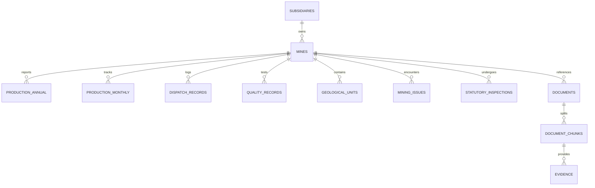

# GeoVault AI — Phase 0: Data Discovery Report

**Project**: GeoVault AI — AI-Powered Geological, Mining and Other Reporting Solution for CMPDI/CIL Subsidiaries  
**Document Status**: Phase 0 Baseline Discovery (READ-ONLY Analysis of `Coal data/`)  
**Discovery Date**: September 2026  
**Operating Standard**: Strictly adhering to `AGENTS.md` (Data-First Development Rule, No-Guess Policy, Authorization Before Retrieval)

---

## 1. Executive Summary & Corpus Overview

An exhaustive, recursive inspection of the authoritative source repository `Coal Data/` was conducted. In accordance with Section 9 of `AGENTS.md`, all files were accessed in **READ-ONLY** mode without modifying, moving, renaming, or deleting any original records.

The dataset is partitioned into two complementary tiers:
1. **Operational / Mine-Level Corpus (Core Synthetic Ground Truth)**: A clean, multi-dimensional relational and textual record covering **3 synthetic CMPDI/CIL subsidiary mines** across a 5-year operating window (**FY2021 – FY2025**). This dataset possesses deep cross-domain linkages spanning production, targets, dispatch logistics, quality metrics, geomechanical units, statutory inspections, operational issues, and legacy audit memos.
2. **Official / Macro-Level Corpus (Government & Industry Publications)**: Macroeconomic, national inventory, captive/commercial mine production, and official statistical publications from the **Ministry of Coal (MoC)**, **Coal Controller's Organisation (CCO)**, and **Geological Survey of India (GSI)** spanning FY2014-15 through FY2025-26.

### Summary Statistics & Source File Count Reconciliation
* **Total Discovered Files**: **32 authoritative files** across 11 subdirectories
  * **Operational Synthetic Corpus (20 files)**: 1 Data Dictionary (`.json`) + 1 Mine Master (`.csv`) + 9 operational domain tables (`.csv`) + 8 legacy operational memos (`.pdf`) + 1 synthetic OCR scan (`.txt`). *(Note: Initial preliminary scoping notes cited "23 items" by including top-level directory entries; the exhaustive file manifest confirms exactly 20 operational files).*
  * **Official Macro-Level Corpus (12 files)**: 2 Macro CSVs (`Annual_Coal_Production.csv`, `Coal-Production-of-Captive-and-Commercial-Coal-Mines.csv`) + 5 multi-sheet statistical Excel workbooks (`cdchap1.xlsx` through `cdchap5.xlsx`, ~102 sheets) + 5 official national publication PDFs (CCO, MoC, GSI).
* **Total Corpus Disk Size**: ~139.7 MB
* **Structured Data Tables**: 11 CSV files + 5 multi-sheet Excel workbooks (~102 individual sheets)
* **Unstructured Documents**: 13 PDF documents (8 operational legacy memos + 5 national publications) + 1 OCR text extract
* **Pre-downloaded Local LLM**: `models/Qwen3-8B-Q4_K_M.gguf` (5.03 GB) present and verified in workspace root
* **Operating Mandate**: `Coal Data/` is strictly READ-ONLY. Zero files were added, renamed, modified, or removed.

---

## 2. Directory & File Inventory

| Relative Path | Format | Size (Bytes) | Category | Description / Coverage |
|---|---|---|---|---|
| `DATA_DICTIONARY.json` | JSON | 857 B | Metadata | High-level dictionary describing operational CSV purposes |
| `mine_master.csv` | CSV | 491 B | Master Data | Canonical master registry of the 3 prototype mines |
| `production/production_2021_2025.csv` | CSV | 1,053 B | Production | Annual production, dispatch, availability, target achievement |
| `targets/annual_targets_2021_2025.csv` | CSV | 1,013 B | Planning | Annual targets, actuals, variance, and achievement % |
| `monthly/monthly_production.csv` | CSV | 6,125 B | Production | Monthly production and target variance (180 records: 3 mines × 5 yrs × 12 mos) |
| `dispatch/dispatch_summary.csv` | CSV | 745 B | Logistics | Annual dispatch, production-dispatch gap, transport mode, logistics status |
| `quality/coal_quality_summary.csv` | CSV | 646 B | Quality | Ash %, moisture %, quality management action |
| `geology/geological_units.csv` | CSV | 1,151 B | Geotechnical | Seams/panels/blocks, horizon depths, thickness, structure, risk rating |
| `issues/mining_issue_log.csv` | CSV | 1,574 B | Operations | Incident log: monsoon flooding, drum wear, fault zones, water ingress |
| `inspections/inspection_register.csv` | CSV | 2,229 B | Statutory | Safety/statutory inspections, focus areas, status, observations |
| `parliamentary/parliamentary_qa.csv` | CSV | 1,311 B | Benchmark | Reference questions & golden answers for query routing & validation |
| `legacy_pdfs/DEOM-01_2022_monsoon_issue.pdf` | PDF (1p) | 2,337 B | Unstructured | Internal note on Dharani East monsoon water accumulation & pumping |
| `legacy_pdfs/DEOM-01_2024_quality_note.pdf` | PDF (1p) | 2,226 B | Unstructured | Review memo on elevated ash in mining block & selective blending |
| `legacy_pdfs/DEOM_2024_ocr_extract.txt` | TXT | 446 B | Unstructured | Synthetic OCR extract regarding haul road congestion at crusher approach |
| `legacy_pdfs/KNUG-02_2022_ventilation.pdf` | PDF (1p) | 2,174 B | Unstructured | District ventilation review on below-design air quantity in P-2 |
| `legacy_pdfs/KNUG-02_2024_fault.pdf` | PDF (1p) | 2,176 B | Unstructured | Geological encounter report on faulted zone at P-2 eastern edge |
| `legacy_pdfs/KNUG-02_2025_water.pdf` | PDF (1p) | 2,104 B | Unstructured | Water ingress note regarding fractured zone at Panel P-3 |
| `legacy_pdfs/SSOP-03_2023_equipment.pdf` | PDF (1p) | 2,192 B | Unstructured | Maintenance record on surface miner cutting drum wear & availability |
| `legacy_pdfs/SSOP-03_2024_dust.pdf` | PDF (1p) | 2,106 B | Unstructured | Environmental inspection memo on crusher approach dust suppression |
| `legacy_pdfs/SSOP-03_2025_logistics.pdf` | PDF (1p) | 2,163 B | Unstructured | Dispatch logistics note on rail loading congestion & road diversion |
| `Official Data/Annual_Coal_Production.csv` | CSV | 416 B | Macro Stat | National coking, non-coking, total coal production & growth (2014–2025) |
| `Official Data/Coal-Production-of-Captive-and-Commercial-Coal-Mines.csv` | CSV | 1,206 B | Macro Stat | State-wise, company-wise captive/commercial production (39 records) |
| `Official Data/cdchap1.xlsx` | XLSX | 181,259 B | Macro Stat | CCO Coal Directory Ch 1: Geological Coal Resources (10 sheets) |
| `Official Data/cdchap2.xlsx` | XLSX | 582,074 B | Macro Stat | CCO Coal Directory Ch 2: Production Trends & Technology (33 sheets) |
| `Official Data/cdchap3.xlsx` | XLSX | 332,618 B | Macro Stat | CCO Coal Directory Ch 3: Despatch & Offtake by Sector (35 sheets) |
| `Official Data/cdchap4.xlsx` | XLSX | 126,401 B | Macro Stat | CCO Coal Directory Ch 4: Pit-Head Closing Stock (12 sheets) |
| `Official Data/cdchap5.xlsx` | XLSX | 104,195 B | Macro Stat | CCO Coal Directory Ch 5: Coal Prices, Royalties, Values (12 sheets) |
| `Official Data/coal directory 22 23.pdf` | PDF (271p)| 48.3 MB | Macro Doc | MoC / CCO Annual Coal Directory 2022-23 (Heavy raster/scanned content) |
| `Official Data/coal directory 24 25.pdf` | PDF (266p)| 15.0 MB | Macro Doc | MoC / CCO Annual Coal Directory 2024-25 (Digital PDF) |
| `Official Data/Coal Production 25-26.pdf` | PDF (7p) | 234 KB | Macro Doc | MoC Annual Report 2025-26, Chapter 09: Coal & Lignite Production |
| `Official Data/National Inventory for Coal and lignite_2025.pdf`| PDF (51p) | 9.1 MB | Macro Doc | GSI National Energy Resources Mission-IIB Resource Inventory 2025 |
| `Official Data/Provisional Coal Statistics 2022-23.pdf` | PDF (174p)| 60.4 MB | Macro Doc | CCO Provisional Coal Statistics 2022-23 (Mixed digital/scanned) |

---

## 3. Discovered Entities & Domain Structure

### 3.1 Canonical Operating Mines
The operational data revolves around **3 canonical mines**:

| Mine Code | Mine Name | Subsidiary | Mine Type | Coal Specification | Geographic Sector |
|---|---|---|---|---|---|
| **`DEOM-01`** | Dharani East Opencast Mine | Shakti Coalfields Ltd. | Opencast | Non-coking thermal coal | Central Coal Belt, Eastern Sector |
| **`KNUG-02`** | Koyna North Underground Mine | Dakshin Bharat Coal Mining Ltd. | Underground | Medium-volatile bituminous thermal | Western Coal Belt, Northern Block |
| **`SSOP-03`** | Satpura South Opencast Project | Vindhya Mineral & Coal Corporation Ltd. | Opencast | High-ash thermal coal | Southern Coal Belt, Satpura Sector |

### 3.2 Canonical Geological Units & Seams
* **Dharani East (`DEOM-01`)**: Seams A (8.4m depth, 2.1m thick), B (11.7m depth, 2.8m thick), C (16.2m depth, 1.9m thick)
* **Koyna North (`KNUG-02`)**: Panels P-1 (420–470m depth, 2.2–2.6m thick), P-2 (455–510m depth, 2.0–2.4m thick), P-3 (490–535m depth, 1.8–2.2m thick)
* **Satpura South (`SSOP-03`)**: Blocks S-1 (6.5m depth, 2.7m thick), S-2 (9.2m depth, 3.1m thick), S-3 (13.8m depth, 2.5m thick)

### 3.3 Reporting Horizon & Granularity
* **Temporal Scope**: FY2021 to FY2025 (Annual & Monthly intervals for mines; FY2014-15 to FY2025-26 for national stats).
* **Metric Units**:
  * Production: Million Tonnes (MT)
  * Dispatch: Million Tonnes (MT)
  * Stock / Gaps: Million Tonnes (MT)
  * Ash / Moisture: Percentage (%)
  * Availability / Target Achievement: Percentage (%)
  * Depth & Thickness: Meters (m)

---

## 4. Cross-Dataset Reconciliation, Conflicts & Data Inconsistencies

Deep programmatic cross-validation across structured files and unstructured documents revealed key observations:

### 4.1 Reconciled Fields (Exact Agreement)
* **Annual Targets vs Annual Production**: `actual_production_mt` in `production_2021_2025.csv` exactly matches `actual_mt` in `annual_targets_2021_2025.csv` across all 15 mine-year rows (0 discrepancies).
* **Dispatch Gap Identity**: `production_dispatch_gap_mt` in `dispatch_summary.csv` equals `actual_production_mt - dispatch_mt` across all 15 mine-year records.

### 4.2 Identified Conflicts & Divergences (Critical for AGENTS.md Conflict Engine)
1. **SSOP-03 (FY2025) Logistics Status Divergence**:
   * *Structured Record (`dispatch/dispatch_summary.csv`)*: Marks `logistics_status = "Normal"` with a minor gap of `0.08 MT` (`production = 7.26 MT`, `dispatch = 7.18 MT`).
   * *Issue Register (`issues/mining_issue_log.csv`)*: Records a critical disruption: `"Logistics | Rail loading congestion | Impact: Dispatch backlog of 0.31 Mt"`.
   * *Unstructured Report (`legacy_pdfs/SSOP-03_2025_logistics.pdf`)*: Documents: *"Rail loading congestion created a dispatch backlog despite mine production remaining close to target. Rake planning was revised and temporary road dispatch was used to reduce stock accumulation"*.
   * *Significance*: Demonstrates an explicit real-world conflict between high-level annual dispatch status ("Normal") and granular operational logs/memos (0.31 MT backlog, emergency road dispatch). Per Section 42/43 of `AGENTS.md`, the system must classify this as `CONFLICT` rather than silently suppressing the operational backlog.
2. **Temporal & Reference Discrepancy (`DEOM_2024_ocr_extract.txt` vs `mining_issue_log.csv`)**:
   * *OCR Document*: File named `DEOM_2024_ocr_extract.txt` with reference `DEOM/OPS/2024/17` reports crusher approach haul road congestion causing +9% cycle time.
   * *Issue Register*: Categorizes this exact event under **Year 2025** in `mining_issue_log.csv`.
   * *Significance*: Potential temporal discrepancy between the document's synthetic filing year (2024) and the annual register logging year (2025).

### 4.3 Data Quality & Hygiene Issues
1. **Non-Numeric Character in Quantitative Column (`Annual_Coal_Production.csv`)**:
   * Row 6 (FY 2020-21) has `Growth = "'-2.02"` containing a leading single quotation mark. Ingestion pipeline must parse and clean this to float `-2.02`.
2. **UTF-8 Byte Order Mark (BOM)**:
   * `Annual_Coal_Production.csv` begins with `\ufeffYear`.
   * `Coal-Production-of-Captive-and-Commercial-Coal-Mines.csv` begins with `\ufeffEnd_Use`.
   * Ingestion must decode with `utf-8-sig` to prevent mangled dictionary keys.
3. **Floating Point Rounding in Monthly Aggregations**:
   * Sum of monthly production in `monthly_production.csv` deviates from annual totals in `production_2021_2025.csv` by `0.001` to `0.002 MT` in 4 mine-years (e.g., KNUG-02 2024 sum is 1.658 MT vs annual reported 1.66 MT) due to decimal rounding.
4. **Special Character Encoding (`geological_units.csv`)**:
   * Contains Unicode en-dashes (`–`, `\u2013`) in ranges (`4–6°`, `420–470`) and degree symbols (`°`). Database schema and text ingestion must enforce UTF-8 collation.

---

## 5. Document Processing & OCR Assessment

| Document | Page Count | Text Extracted via PyMuPDF | OCR Required? | Notes |
|---|---|---|---|---|
| All 8 Legacy PDFs | 1 page each | 100% digital text extracted | No (Native digital) | Internal memos with clear key-value summaries |
| `DEOM_2024_ocr_extract.txt` | N/A (Text) | 100% raw text | Simulated OCR | Represents legacy OCR scanned extract |
| `coal directory 22 23.pdf` | 271 pages | Low (~78 chars/page avg; 30% empty pages) | **Yes (Selective OCR)** | Many scanned / rasterized statistical tables |
| `coal directory 24 25.pdf` | 266 pages | High (1,716 chars/page avg) | No (Digital vector/text) | Native text PDF published by MoC |
| `Coal Production 25-26.pdf` | 7 pages | High (1,166 chars/page avg) | No (Digital vector/text) | Ministry chapter report |
| `National Inventory 2025.pdf` | 51 pages | High (1,778 chars/page avg) | No (Digital vector/text) | GSI resource report |
| `Provisional Coal Statistics 22-23` | 174 pages | Moderate (463 chars/page avg) | Partial (Mixed) | Some scanned tabular pages |

> [!NOTE]
> **Key Optimization**: The Excel workbooks (`cdchap1.xlsx` through `cdchap5.xlsx`) directly provide clean, cell-level tabular data for the statistical tables featured in the Coal Directory. We should ingest these structured workbooks directly into relational/analytical tables, avoiding error-prone OCR for numerical tables.

---

## 6. Proposed PostgreSQL Database Schema

Based strictly on the discovered datasets, the schema partitions into:
1. **Core Governance & Access Control (RBAC/ABAC)**
2. **Mine Operational Relational Entities**
3. **National / Macro Statistical Entities**
4. **Unstructured Knowledge & Vector Embeddings (`pgvector`)**
5. **Auditing, Queries & Evidence**

### Table Definitions

#### A. Governance & Master Data
* **`subsidiaries`**: `subsidiary_id` (PK), `subsidiary_code`, `subsidiary_name`.
* **`mines`**: `mine_code` (PK), `mine_name`, `subsidiary_id` (FK), `mine_type` (Opencast/Underground), `coal_type`, `location`.
* **`users`**: `user_id` (PK), `username`, `email`, `role`, `department`, `clearance_level`, `assigned_mine_code`.

#### B. Mine Operational Data
* **`production_annual`**: `id` (PK), `mine_code` (FK), `year` (INT), `target_mt` (DECIMAL), `actual_production_mt` (DECIMAL), `variance_mt` (DECIMAL), `achievement_pct` (DECIMAL), `equipment_availability_pct` (DECIMAL).
* **`production_monthly`**: `id` (PK), `mine_code` (FK), `year` (INT), `month` (INT), `production_mt` (DECIMAL), `target_mt` (DECIMAL), `variance_mt` (DECIMAL).
* **`dispatch_summary`**: `id` (PK), `mine_code` (FK), `year` (INT), `dispatch_mt` (DECIMAL), `production_dispatch_gap_mt` (DECIMAL), `mode` (VARCHAR), `logistics_status` (VARCHAR).
* **`coal_quality`**: `id` (PK), `mine_code` (FK), `year` (INT), `ash_pct` (DECIMAL), `moisture_pct` (DECIMAL), `quality_action` (TEXT).
* **`geological_units`**: `id` (PK), `mine_code` (FK), `unit_name` (VARCHAR), `depth_or_horizon_m` (VARCHAR), `thickness_m` (VARCHAR), `structure` (VARCHAR), `geological_risk` (VARCHAR), `observation` (TEXT).
* **`mining_issue_log`**: `id` (PK), `mine_code` (FK), `year` (INT), `issue_category` (VARCHAR), `observed_issue` (TEXT), `operational_impact` (TEXT), `corrective_action` (TEXT).
* **`inspection_register`**: `id` (PK), `mine_code` (FK), `year` (INT), `inspection_focus` (VARCHAR), `status` (VARCHAR), `observation` (TEXT), `responsible_officer` (VARCHAR).

#### C. National & Macro Statistical Data
* **`national_annual_production`**: `id` (PK), `year` (VARCHAR, e.g. "2024-25"), `coking_coal_mt` (DECIMAL), `non_coking_coal_mt` (DECIMAL), `growth_pct` (DECIMAL), `total_mt` (DECIMAL).
* **`captive_commercial_production`**: `id` (PK), `end_use` (VARCHAR), `state` (VARCHAR), `company` (VARCHAR), `quantity_mt` (DECIMAL).
* **`macro_statistical_tables`**: `id` (PK), `source_file` (VARCHAR), `chapter` (INT), `table_id` (VARCHAR), `table_title` (TEXT), `data_json` (JSONB).

#### D. Unstructured Knowledge & Retrieval (`pgvector`)
* **`documents`**: `document_id` (PK), `file_name`, `file_hash`, `category` (Legacy Memo, Scan Extract, National Inventory, Coal Directory), `mine_code` (Nullable FK), `year`, `page_count`, `classification` (INTERNAL/RESTRICTED/CONFIDENTIAL).
* **`document_chunks`**: `chunk_id` (PK), `document_id` (FK), `page_number`, `chunk_index`, `content` (TEXT), `embedding` (VECTOR(1024) / BGE-M3), `access_scope` (JSONB / mine, department, clearance).

#### E. Evidence, Audit & Conflict Tracking
* **`conflicts`**: `conflict_id` (PK), `mine_code`, `year`, `metric_or_topic`, `source_a_type`, `source_a_value`, `source_b_type`, `source_b_value`, `status` (`CONFLICT`).
* **`query_audit_logs`**: `log_id` (PK), `user_id`, `question`, `route_selected` (SQL/RAG/HYBRID/ANALYTICS/TOPIC/REPORT), `authorized_scope_applied`, `evidence_ids`, `response_summary`, `created_at`.

---

## 7. Ingestion Strategy

1. **Idempotent Ingestion Pipeline**:
   * Compute SHA-256 file hashes before parsing. Skip unmodified files on re-runs.
2. **Data Cleaning & Normalization**:
   * Strip UTF-8 BOM (`utf-8-sig`).
   * Clean strings to numeric floats (e.g., strip `'` from `'-2.02`).
   * Normalize canonical mine IDs: `DEOM-01`, `KNUG-02`, `SSOP-03`.
3. **Structured Ingestion**:
   * Ingest operational CSVs into normalized tables.
   * Ingest macro CSVs and selected statistical Excel sheets (`cdchap1`–`5`) into structured relational/JSONB stores.
4. **Unstructured Chunking & Vectorization**:
   * Extract page-aware text from legacy PDFs and official publications using PyMuPDF.
   * Attach strict metadata to every chunk: `mine_code`, `year`, `department`, `page_number`, `classification`.
   * Generate embeddings via `bge-m3` and store with HNSW index in `pgvector`.
5. **Conflict Seeding**:
   * Programmatically evaluate known discrepancies (e.g., SSOP-03 2025 logistics status vs issue log) and register them into the `conflicts` repository.

---

## 8. Environment Verification & Prerequisites

### Host Environment Status
* **Operating System**: Windows
* **Python**: `3.13.1` installed and operational.
* **Docker**: `29.6.2` installed and operational.
* **Docker Compose**: `v5.3.1` installed and operational.
* **Git**: `2.50.1` installed.
* **Local Model Artifact**: `models/Qwen3-8B-Q4_K_M.gguf` (5.03 GB) **present and verified**.

### Missing Prerequisites / Architecture Notes
* **Node.js / npm**: Not in host system `PATH`.
  * *Resolution*: As specified in `AGENTS.md` Docker Architecture (Section 13), the Next.js frontend will run inside its standard containerized Docker service (`node:20-alpine`), requiring no host Node.js installation.
* **PostgreSQL with `pgvector` & Redis**:
  * Provided via Docker Compose (`pgvector/pgvector:pg16` and `redis:7-alpine`).
* **Local LLM Server**:
  * `llama.cpp` container mounted to `./models/Qwen3-8B-Q4_K_M.gguf` exposing OpenAI-compatible endpoint on internal Docker network (`http://llm:8080`).

---

## 9. Next Implementation Steps (Post-Approval)

1. **Phase 1: Environment & Container Baseline**
   * Configure `.env`, `docker-compose.yml` (FastAPI backend, Next.js frontend, PostgreSQL 16 + pgvector, Redis, Celery, llama.cpp service).
2. **Phase 2: Database Initialization & Migrations**
   * Implement SQLAlchemy models and Alembic migrations reflecting the schema proposed above.
3. **Phase 3: Automated Ingestion & Embedding Pipeline**
   * Implement cleaning, normalization, metadata tagging, chunking, and idempotent insertion for both structured CSVs and unstructured PDFs.
4. **Phase 4: Authorization Engine (RBAC/ABAC)**
   * Implement centralized `AuthorizationService` enforcing *Authorization Before Retrieval*.
5. **Phase 5: Query Router, Analytics & Evidence Engines**
   * Deterministic calculations (Python/SQL) + RAG retrieval + Conflict detection + LLM synthesis.
