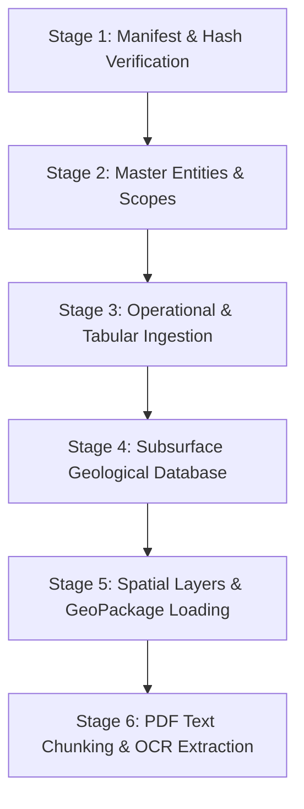
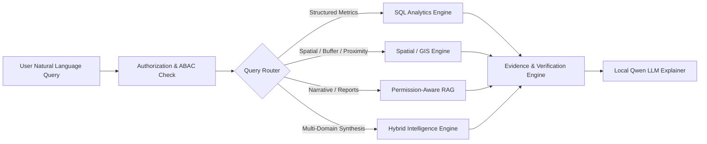

# 🗺️ GeoVault AI — New Dataset Discovery & Architectural Plan

> **Authoritative Candidate Dataset:** `F:\GeoVault\geo_data\`  
> **Status:** Inspection, Mapping & Planning Only (Read-Only Analysis)  
> **Date:** September 21, 2026  
> **Target:** Smart India Hackathon 2026 — Problem Statement 26023 (CMPDI / Coal India Limited)

---

## 1. Dataset Overview

The new candidate dataset located at `F:\GeoVault\geo_data\` represents a **massive, multi-modal upgrade** from the single-mine (`DEOM-01`) prototype to a **comprehensive 5-mine enterprise coalfield ecosystem** spanning **Coal India Limited (CIL)** subsidiaries **SECL** and **NCL**.

Unlike the previous dataset which relied primarily on flat tabular files and unstructured documents, the new dataset contains:
1. **Fully normalized multi-year operational datasets** (FY 2019–20 through FY 2024–25).
2. **Deep geological borehole stratification data** (60 collars, 600 lithological intervals, 21 distinct coal seams).
3. **Multi-layer geospatial datasets** in 3 interoperable GIS formats (**OGC GeoPackage**, **GeoJSON**, **ESRI Shapefiles**).
4. **Geotechnical, structural, and land-use layers** (bench stability, geological contacts, seam belts, land classification).
5. **CAD/DXF engineering drawings** (10 cross-section profiles A-A' and B-B').
6. **GeoTIFF floating-point rasters** (10m Digital Elevation Models and Seam Thickness surfaces).
7. **Official 4-page Annual Performance Reports** (30 standardized PDFs matching the official CMPDI design with manifest metadata).
8. **High-resolution scanned field logs and checklists** (15 OCR-targeted operational records).
9. **Curated QA Acceptance Benchmark** (150 ground-truth geospatial and geological query test cases).

```
F:\GeoVault\geo_data\
├── Excel/                       # 6 Multi-year operational workbooks + validation specs
├── Geological/                  # Geospatial, master geology, CAD, rasters, and per-mine GIS packages
│   ├── dxf/                     # 10 CAD cross-section DXF files
│   ├── geojson/                 # 9 Multi-mine combined GeoJSON layers
│   ├── maps/                    # Geological atlas PDF + 5 regional map PNGs
│   ├── mines/                   # 5 Dedicated mine folders (DIPKA, DUDHICHUA, GEVRA, KUSMUNDA, NIGAHI)
│   ├── raster/                  # 10 GeoTIFF rasters (DEM + Coal Thickness Surfaces)
│   ├── shapefile/               # 45 Multi-mine combined ESRI Shapefile components
│   └── GeoVault_Geospatial_All_Mines_FINAL.gpkg # Unified OGC GeoPackage container
├── OCR/                         # 15 Scanned handwritten/field document images
└── PDF/                         # 30 Standardized 4-page Annual Mine Reports + pdf_manifest.csv
```

---

## 2. Complete File Inventory

A recursive census across `F:\GeoVault\geo_data\` identified **418 total files** across **25 directories** totaling **~64.5 MB** of uncompressed assets.

### 2.1 File Count by Extension

| File Extension | File Count | Total Size (MB) | Primary Purpose / Domain |
| :--- | :---: | :---: | :--- |
| **.shp** | 54 | 0.88 MB | ESRI Shapefile feature geometries (9 layers × 5 mines + 9 combined) |
| **.dbf** | 54 | 0.32 MB | Attribute tables for ESRI Shapefiles |
| **.prj** | 54 | 0.03 MB | Projection files (All WGS 84 / EPSG:4326) |
| **.shx** | 54 | 0.08 MB | Spatial indexing files for ESRI Shapefiles |
| **.cpg** | 54 | 0.01 MB | Code page definitions (`UTF-8`) |
| **.geojson** | 54 | 1.15 MB | Web-ready GeoJSON feature collections (9 layers × 5 mines + 9 combined) |
| **.pdf** | 31 | 18.42 MB | 30 Mine Annual Reports (4-page official layout) + 1 Geological Atlas (6 pages) |
| **.png** | 20 | 38.65 MB | 15 Scanned OCR records + 5 Regional Geological Maps |
| **.xlsx** | 12 | 1.84 MB | 6 Operational workbooks + 1 Geological Master + 5 Per-mine Geological workbooks |
| **.dxf** | 10 | 0.72 MB | 10 AutoCAD DXF Cross-Section drawings (A-A' and B-B' per mine) |
| **.tif** | 10 | 0.45 MB | 10 GeoTIFF raster surfaces (5 DEMs + 5 Coal Thickness Surfaces) |
| **.gpkg** | 1 | 2.22 MB | Unified OGC GeoPackage (All spatial layers across all mines) |
| **.csv** | 1 | 0.01 MB | `pdf_manifest.csv` (Cataloging 30 PDFs with section schemas) |
| **.json** | 3 | 0.01 MB | Validation reports (`Excel`, `Geological`, `PDF`) |
| **.md** | 3 | 0.02 MB | `README.md`, `QA_ACCEPTANCE_GUIDE.md`, `PUBLIC_REFERENCE_SOURCES.md` |
| **.txt** | 2 | 0.01 MB | `requirements-geospatial.txt`, `PDF/README.txt` |
| **.py** | 1 | 0.01 MB | `prototype_loader.py` (GeoPandas helper utility) |
| **TOTAL** | **418** | **~64.8 MB** | **Multi-Modal Enterprise Geospatial & Operational Repository** |

---

## 3. Mine, Subsidiary, and Temporal (Financial Year) Inventory

### 3.1 Canonical Mine Identity Matrix

Every operational, geological, spatial, and PDF asset in `geo_data/` strictly aligns to the following 5 canonical mega-mines:

| Operational Mine ID | Geospatial Mine ID | Mine Code | Official Mine Name | CIL Subsidiary | Coalfield | State | Mine Type | Central Coordinates |
| :--- | :--- | :--- | :--- | :--- | :--- | :--- | :--- | :--- |
| **GV001** | `M-GEVRA` | `GEVRA` | Gevra Opencast Project | **SECL** | Korba Coalfield | Chhattisgarh | Opencast (OCP) | 22.3333° N, 82.5833° E |
| **GV002** | `M-KUSMUNDA` | `KUSMUNDA` | Kusmunda Opencast Project | **SECL** | Korba Coalfield | Chhattisgarh | Opencast (OCP) | 22.3167° N, 82.6833° E |
| **GV003** | `M-DIPKA` | `DIPKA` | Dipka Opencast Project | **SECL** | Korba Coalfield | Chhattisgarh | Opencast (OCP) | 22.3167° N, 82.5333° E |
| **GV004** | `M-NIGAHI` | `NIGAHI` | Nigahi Opencast Project | **NCL** | Singrauli Coalfield | Madhya Pradesh | Opencast (OCP) | 24.1333° N, 82.6167° E |
| **GV005** | `M-DUDHICHUA` | `DUDHICHUA` | Dudhichua Opencast Project | **NCL** | Singrauli Coalfield | MP / UP Border | Opencast (OCP) | 24.1500° N, 82.6833° E |

### 3.2 Reporting Period & Financial Year Matrix

The dataset provides full historical continuity over **6 consecutive Financial Years (FY)**:
1. `2019-20` (Baseline year; YoY growth mathematically null)
2. `2020-21` (Full operations, YoY tracked)
3. `2021-22` (Full operations, YoY tracked)
4. `2022-23` (Full operations, YoY tracked)
5. `2023-24` (Full operations, YoY tracked)
6. `2024-25` (Current active reporting year)

Total Mine-Year Operational Combinations: **5 Mines × 6 Years = 30 Complete Fact Records**.

---

## 4. Operational Data Mapping

The tabular data located in `F:\GeoVault\geo_data\Excel\` provides complete operational performance metrics:

### 4.1 Master Operational Workbook: `GeoVault_Synthetic_Master_Dataset.xlsx`
* **`Mine_Year_Facts` (30 rows × 36 columns)**:
  * Primary Key: `(Mine_ID, Financial_Year)`
  * Core Production: `Production_Target_MT`, `Actual_Production_MT`, `Production_Variance_MT`, `Achievement_%`, `YoY_Growth_%`.
  * Dispatch & Logistics: `Offtake_Target_MT`, `Actual_Offtake_MT`, `Offtake_Achievement_%`, `Avg_Daily_Production_000T`.
  * Stripping & Overburden: `Target_OB_Removal_McuM`, `Actual_OB_Removal_McuM`, `Stripping_Ratio_Target`, `Stripping_Ratio_Actual`.
  * Reliability & Workforce: `Manpower_Available`, `HEMM_Availability_%`, `Equipment_Availability_%`, `Downtime_Hours`, `Rainfall_Impact_Days`.
  * Safety & Statutory: `Safety_Incident_Count`, `LTIFR`, `Fatalities`.
  * Environmental Compliance: `Reclamation_Ha`, `Mine_Water_Treated_ML`, `Dust_Compliance_%`.
  * Qualitative Commentary: `Primary_Cause_of_Shortfall`, `Geological_Observation`.
* **`Mine_Profile` (5 rows × 6 columns)**: Mine metadata, subsidiary affiliation, state, basin.
* **`Equipment` (150 rows × 7 columns)**: Draglines, rope shovels, hydraulic excavators, surface miners, dumpers, and blast hole drills across all 5 mines.
* **`Safety` (30 rows × 9 columns)**: Annual safety incident breakdown, root cause classification, DGMS statutory compliance.
* **`Environment` (30 rows × 9 columns)**: Ambient air quality (PM10/PM2.5), water treatment effluent quality, green belt plantation acreage.
* **`Operational_Events` (5 rows × 5 columns)**: Significant operational anomalies (e.g. monsoon flooding, haul road subsidence).

### 4.2 Yearly Slice Workbooks
* `GeoVault_2020_21_5_Mines.xlsx` through `GeoVault_2024_25_5_Mines.xlsx` (Contains incremental and cumulative historical views with pre-calculated YoY audits).

---

## 5. Geological Data Mapping

The master workbook `Geological/GeoVault_Geological_Master_FINAL.xlsx` and per-mine workbooks in `Geological/mines/<MINE>/` contain rich geological and subsurface engineering data:

### 5.1 Subsurface Geological Entities

1. **Borehole Master (`Boreholes` — 60 records)**:
   * Attributes: `borehole_id`, `mine_id`, `mine_name`, `latitude`, `longitude`, `rl_m`, `total_depth_m`, `intersected_seam`, `from_depth_m`, `to_depth_m`, `lithology_summary`, `coal_thickness_m`, `quality_band`, `status`.
   * Distribution: Exactly 12 boreholes per mine (e.g. `GEVRA-BH-001` to `GEVRA-BH-012`).

2. **Borehole Lithological Intervals (`Borehole_Intervals` — 600 records)**:
   * Attributes: `Borehole_ID`, `Mine_ID`, `Mine_Code`, `Interval_No`, `From_Depth_m`, `To_Depth_m`, `Thickness_m`, `Lithology`, `Stratigraphic_Unit`, `Coal_Bearing`, `Coal_Seam`, `Weathering_Class`, `Sample_ID`.
   * Lithology Classes: Sandstone, Shale, Carbonaceous Shale, Coal, Alluvium/Soil.
   * Granularity: Exactly 10 continuous lithological run intervals per borehole.

3. **Coal Seam Master (`Coal_Seams` — 21 records)**:
   * Attributes: `seam_id`, `mine_id`, `mine_name`, `sequence_order`, `avg_thickness_m`, `synthetic_dip_deg`, `synthetic_strike_deg`, `continuity`, `quality_band`.
   * Seams Represented:
     * **Gevra OCP**: Upper Kusmunda, Lower Kusmunda, Gevra Seam.
     * **Kusmunda OCP**: Upper Kusmunda, Lower Kusmunda.
     * **Dipka OCP**: Upper Kusmunda, Lower Kusmunda, Dipka Bottom.
     * **Nigahi OCP**: Purewa Top, Purewa Bottom, Turra Seam.
     * **Dudhichua OCP**: Purewa Top, Purewa Bottom, Turra Seam.

4. **Geological Stratigraphic Units (`Geological_Units` — 30 records)**:
   * Formations/members (Barakar Formation, Karharbari Formation, Raniganj Formation, Alluvium).

5. **Survey & Geodetic Benchmarks (`Survey_Points` — 125 records)**:
   * High-precision benchmark stations: `Survey_Point_ID`, coordinates (`Latitude`, `Longitude`), `RL_m` (Reduced Level), `Point_Type` (`BENCH_RL`, `BOUNDARY_PILLAR`, `GPS_BASE`), accuracy ratings.

6. **Geological Structural Contacts (`Geological_Contacts` — 15 records)**:
   * Structural boundaries: Fault lines, unconformities, unit boundaries between Sandstone and Shale blocks.

7. **Borehole Trajectories (`Borehole_Traces` — 60 records)**:
   * Borehole deviation profiling: `Azimuth_deg`, `Inclination_deg`, `Total_Depth_m`.

8. **Geotechnical Hazard Zones (`Geotechnical_Zones` — 20 records)**:
   * Slope and bench stability zones: `Zone_Type` (`Stable Bench Zone`, `Potential Slip Zone`, `Highwall Caution Zone`, `Overburden Dump Margin`), `Risk_Class` (`LOW`, `MODERATE`, `HIGH`), engineering basis.

9. **Land-Use Classification (`Landuse` — 30 records)**:
   * Operational footprint: Active Quarry, Topsoil Storage, External Overburden Dump, Workshop & Infrastructure, Settling Pond, Reclaimed Green Belt.

10. **Geological Events (`Geological_Events` & `Geological_Events_Spatial` — 10 records)**:
    * Fault reactivation, bench slippage, seepage inflows with localized coordinates and remediation logs.

11. **Cross-Section Geometries (`Cross_Section_Points` — 210 records)**:
    * 2 cross-sections per mine (A-A' along strike, B-B' across dip), chainage (0 to 1,200m) and ground RL.

---

## 6. Spatial Data Mapping

All spatial data adheres strictly to **WGS 84 (EPSG:4326 / OGC CRS84)** in decimal degrees `[Longitude, Latitude]`.

### 6.1 Spatial Layer Matrix

| Layer Name | Geometry Type | Combined Count | Per-Mine Count | Key Attributes | Spatial Table Target |
| :--- | :--- | :---: | :---: | :--- | :--- |
| **borehole_intervals** | Point | 600 | 120 / mine | `Borehole_ID`, `Interval_No`, `Thickness_m`, `Lithology`, `Coal_Seam` | `spatial_borehole_intervals` |
| **boreholes** | Point | 60 | 12 / mine | `borehole_id`, `total_depth_m`, `rl_m`, `intersected_seam` | `spatial_boreholes` |
| **borehole_traces** | LineString | 60 | 12 / mine | `Trace_ID`, `Azimuth_deg`, `Inclination_deg`, `Total_Depth_m` | `spatial_borehole_traces` |
| **survey_points** | Point | 125 | 25 / mine | `Survey_Point_ID`, `Point_Type`, `RL_m`, `Survey_Date`, `Accuracy` | `spatial_survey_points` |
| **coal_seam_belts** | Polygon | 21 | 4–5 / mine | `Seam_ID`, `Width_m`, `Feature_Type`, `Mine_Code` | `spatial_coal_seam_belts` |
| **geological_contacts** | LineString | 15 | 3 / mine | `Contact_ID`, `Contact_Type`, `Unit_A`, `Unit_B`, `Confidence` | `spatial_geological_contacts` |
| **geological_units** | Polygon | 30 | 6 / mine | `Geology_Unit_ID`, `Unit_Name`, `Unit_Type`, `Age`, `Relative_Order` | `spatial_geological_units` |
| **geotechnical_zones** | Polygon | 20 | 4 / mine | `Zone_ID`, `Zone_Type`, `Risk_Class`, `Basis` | `spatial_geotechnical_zones` |
| **landuse** | Polygon | 30 | 6 / mine | `Landuse_ID`, `Landuse_Class`, `Status` | `spatial_landuse` |
| **geological_events_spatial** | Point | 10 | 2 / mine | `Event_ID`, `Event_Type`, `Severity`, `Area`, `Action` | `spatial_geological_events` |

### 6.2 OGC GeoPackage Container
* File: `Geological/GeoVault_Geospatial_All_Mines_FINAL.gpkg` (2.22 MB)
* Contains all 19 feature tables per mine in an optimized SQLite spatial index.

### 6.3 CAD Drawings (DXF)
* 10 AutoCAD DXF cross-sections located in `Geological/dxf/`:
  * Format: ASCII DXF Release 2000.
  * Contains layer geometries for ground topography, coal seam profiles, bench cuts, and borehole traces.

### 6.4 Raster GeoTIFF Surfaces
* 10 Float32 GeoTIFF files located in `Geological/raster/`:
  * `<MINE>_synthetic_dem_10m.tif` (100×100 grid, elevation surface in meters).
  * `<MINE>_synthetic_coal_thickness_surface.tif` (100×100 grid, seam isopach thickness in meters).

---

## 7. Document & OCR Mapping

### 7.1 Official Annual Reports (30 PDFs)
* Located in `F:\GeoVault\geo_data\PDF\`.
* Exact 4-page official layout covering each of the 30 mine-year combinations (5 mines × 6 years).
* **Text Extraction Assessment**:
  * 100% digital vector PDFs generated with embedded font streams.
  * Average text density: ~7,250 characters per document across pages 1–4.
  * **PyMuPDF (`fitz`) extracts clean, structured text with 100% fidelity without requiring OCR**.
* Indexed via `PDF/pdf_manifest.csv` with explicit section breakdown:
  * Executive Summary, Mine Profile, Production, Target vs Achievement, Offtake, Overburden, Equipment, Operational Constraints, Geological Observations, Safety, Environment, Operational Event, Management Follow-up, Provenance.

### 7.2 Geological Atlas PDF
* File: `Geological/maps/GeoVault_Geological_Atlas_FINAL.pdf` (6 pages, 2.3 MB).
* Page 1: Overview map; Pages 2–6: Per-mine regional geological maps and cross-sections.

### 7.3 OCR Image Targets (15 Images)
* Located in `F:\GeoVault\geo_data\OCR\`.
* Formats: High-resolution PNGs (1086×1448, 1173×1341, 1097×1434 RGB).
* **Requires OCR Processing (PaddleOCR)**:
  * Field inspection records, drilling log sheets, HEMM maintenance checklists, water quality logs, and incident report slips.

---

## 8. Existing-Schema Compatibility & Gap Analysis

Comparing the NEW dataset against the CURRENT GeoVault database schema (`backend/app/models/`):

### A. Existing Tables That Can Be Reused Unchanged
* `users` & `user_scopes`: RBAC and ABAC structure supports multi-mine access scopes.
* `conflicts`: Conflict engine schema is format-agnostic.
* `evidence`: Traceability evidence schema supports relational, document, and spatial citations.
* `query_audit_logs`: Audit tracking schema is fully reusable.
* `generated_reports`: PDF/DOCX storage metadata schema is fully compatible.

### B. Existing Tables That Need Modification
* `mines`: Needs updating to include real canonical IDs (`GV001` through `GV005`), geographic coordinates, coalfields, and subsidiaries (**SECL**, **NCL**), deprecating the single demo mine `DEOM-01`.
* `subsidiaries`: Needs addition of **SECL** and **NCL** alongside CIL/CMPDI.
* `production_annual`: Must be expanded to support the richer set of metrics present in `Mine_Year_Facts` (e.g. `manpower_available`, `hemm_availability_pct`, `downtime_hours`, `rainfall_impact_days`, `dust_compliance_pct`).
* `documents` & `document_chunks`: Metadata columns need widening to index `mine_code` (`GEVRA`, `KUSMUNDA`, etc.), `financial_year` (`2024-25`), and `report_type` (`ANNUAL_PERFORMANCE`, `GEOLOGICAL_SURVEY`, `OCR_FIELD_LOG`).

### C. New Relational Tables Required
1. `equipment_fleet`: For HEMM inventory, status, and maintenance metrics (150 records).
2. `safety_records`: For granular incident details, severity, root causes, and DGMS reporting (30 records).
3. `environmental_records`: For PM10, PM2.5, effluent treatment, and reclamation acreage (30 records).
4. `boreholes_master`: For borehole collar coordinates, total depths, and status (60 records).
5. `borehole_intervals`: For lithological run depth intervals, thicknesses, and seam intersects (600 records).
6. `coal_seams`: For seam thickness, dip, strike, continuity, and quality bands (21 records).
7. `geological_events`: For structural and operational geological events (10 records).
8. `geotechnical_zones`: For slope and bench stability risk classifications (20 records).
9. `survey_points`: For geodetic and bench control points (125 records).
10. `cross_section_points`: For 2D elevation profiles along section lines A-A' and B-B' (210 records).
11. `qa_benchmarks`: For automated regression evaluation against the 150 official benchmark test cases.

### D. New Spatial Tables Required
* See **Section 10** below.

### E. New Document Types
* `ANNUAL_PERFORMANCE_REPORT`: 30 official 4-page mine reports.
* `GEOLOGICAL_ATLAS`: Regional atlas maps.
* `OCR_DRILLING_LOG`: Scanned borehole and exploratory logs.
* `OCR_INSPECTION_CHECKLIST`: HEMM checklists and field observation sheets.
* `CAD_CROSS_SECTION`: DXF profiles.

### F. New Metadata Required
* `coalfield`: Korba / Singrauli.
* `state`: Chhattisgarh / Madhya Pradesh.
* `financial_year`: Standardized format `2024-25`.
* `provenance_type`: `SYNTHETIC_DEMO`.

### G. New Query/Retrieval Routes Required
* `SPATIAL`: Point-in-polygon, buffer distance, nearest borehole, elevation query.
* `GEOLOGY_LOOKUP`: Stratigraphic sequence, coal seam thickness, lithology intervals.
* `MULTI_MINE_COMPARE`: Side-by-side benchmarking across Gevra, Kusmunda, Dipka, Nigahi, Dudhichua.

---

## 9. Proposed New Database Tables (Relational Schema)

```sql
-- 1. Borehole Master Table
CREATE TABLE boreholes (
    borehole_id VARCHAR(50) PRIMARY KEY,
    mine_id VARCHAR(20) REFERENCES mines(mine_id),
    mine_code VARCHAR(20) NOT NULL,
    latitude DOUBLE PRECISION NOT NULL,
    longitude DOUBLE PRECISION NOT NULL,
    rl_m DOUBLE PRECISION NOT NULL,
    total_depth_m DOUBLE PRECISION NOT NULL,
    intersected_seam VARCHAR(100),
    lithology_summary TEXT,
    coal_thickness_m DOUBLE PRECISION,
    quality_band VARCHAR(50),
    status VARCHAR(50),
    data_type VARCHAR(50) DEFAULT 'SYNTHETIC_DEMO'
);

-- 2. Borehole Intervals (Lithology Runs)
CREATE TABLE borehole_intervals (
    interval_id SERIAL PRIMARY KEY,
    borehole_id VARCHAR(50) REFERENCES boreholes(borehole_id),
    mine_id VARCHAR(20) REFERENCES mines(mine_id),
    mine_code VARCHAR(20) NOT NULL,
    interval_no INT NOT NULL,
    from_depth_m DOUBLE PRECISION NOT NULL,
    to_depth_m DOUBLE PRECISION NOT NULL,
    thickness_m DOUBLE PRECISION NOT NULL,
    lithology VARCHAR(100) NOT NULL,
    stratigraphic_unit VARCHAR(100),
    coal_bearing BOOLEAN DEFAULT FALSE,
    coal_seam VARCHAR(100),
    weathering_class VARCHAR(50),
    sample_id VARCHAR(50),
    data_type VARCHAR(50) DEFAULT 'SYNTHETIC_DEMO'
);

-- 3. Coal Seams Master
CREATE TABLE coal_seams (
    seam_id VARCHAR(100),
    mine_id VARCHAR(20) REFERENCES mines(mine_id),
    mine_code VARCHAR(20) NOT NULL,
    sequence_order INT NOT NULL,
    avg_thickness_m DOUBLE PRECISION NOT NULL,
    synthetic_dip_deg DOUBLE PRECISION,
    synthetic_strike_deg DOUBLE PRECISION,
    continuity VARCHAR(100),
    quality_band VARCHAR(50),
    PRIMARY KEY (seam_id, mine_id)
);

-- 4. Geotechnical Zones Table
CREATE TABLE geotechnical_zones (
    zone_id VARCHAR(50) PRIMARY KEY,
    mine_id VARCHAR(20) REFERENCES mines(mine_id),
    mine_code VARCHAR(20) NOT NULL,
    zone_type VARCHAR(100) NOT NULL,
    risk_class VARCHAR(50) NOT NULL, -- LOW, MODERATE, HIGH
    basis TEXT,
    data_type VARCHAR(50) DEFAULT 'SYNTHETIC_DEMO'
);

-- 5. Survey Benchmark Points
CREATE TABLE survey_points (
    survey_point_id VARCHAR(50) PRIMARY KEY,
    mine_id VARCHAR(20) REFERENCES mines(mine_id),
    mine_code VARCHAR(20) NOT NULL,
    latitude DOUBLE PRECISION NOT NULL,
    longitude DOUBLE PRECISION NOT NULL,
    rl_m DOUBLE PRECISION NOT NULL,
    point_type VARCHAR(50) NOT NULL,
    survey_date DATE,
    horizontal_accuracy_m DOUBLE PRECISION,
    vertical_accuracy_m DOUBLE PRECISION
);

-- 6. QA Ground-Truth Evaluation Table
CREATE TABLE qa_benchmarks (
    qa_id VARCHAR(50) PRIMARY KEY,
    mine_code VARCHAR(20) NOT NULL,
    question TEXT NOT NULL,
    expected_source VARCHAR(100) NOT NULL,
    expected_operation VARCHAR(50) NOT NULL,
    expected_key VARCHAR(100),
    expected_value TEXT NOT NULL,
    answer_type VARCHAR(50) NOT NULL
);
```

---

## 10. Proposed Spatial & PostGIS Tables

### 10.1 PostGIS Infrastructure Assessment
* **Finding**: The active database container runs `postgres:16` with `pgvector`, but **PostGIS extension is currently not installed**.
* **Recommendation**:
  1. **Option A (Native PostGIS — Recommended)**: Build a lightweight multi-extension PostgreSQL container combining `postgis-3` and `pgvector` on Debian 12 / Bookworm.
  2. **Option B (Hybrid OGC GeoPackage + GeoPandas)**: Query `GeoVault_Geospatial_All_Mines_FINAL.gpkg` directly using Python `pyogrio` / `geopandas` via dedicated FastAPI spatial endpoints, storing GeoJSON representations in PostgreSQL `JSONB` columns.

### 10.2 Target PostGIS Layer Schemas (Option A)

```sql
-- PostGIS Layers (SRID: 4326)
CREATE TABLE spatial_boreholes (
    id SERIAL PRIMARY KEY,
    borehole_id VARCHAR(50) UNIQUE,
    mine_code VARCHAR(20),
    depth_m DOUBLE PRECISION,
    geom GEOMETRY(Point, 4326)
);

CREATE TABLE spatial_coal_seam_belts (
    id SERIAL PRIMARY KEY,
    seam_id VARCHAR(100),
    mine_code VARCHAR(20),
    width_m DOUBLE PRECISION,
    geom GEOMETRY(Polygon, 4326)
);

CREATE TABLE spatial_geological_contacts (
    id SERIAL PRIMARY KEY,
    contact_id VARCHAR(50),
    mine_code VARCHAR(20),
    contact_type VARCHAR(100),
    geom GEOMETRY(LineString, 4326)
);

CREATE TABLE spatial_landuse (
    id SERIAL PRIMARY KEY,
    landuse_id VARCHAR(50),
    mine_code VARCHAR(20),
    landuse_class VARCHAR(100),
    geom GEOMETRY(Polygon, 4326)
);
```

---

## 11. Proposed Ingestion Strategy

To ensure zero downtime, idempotency, and audit compliance, ingestion must follow a strict **6-Stage Sequence**:



1. **Stage 1 — Manifest & Hash Verification**:
   * Calculate SHA-256 for all 418 files. Prevent duplicate processing.
2. **Stage 2 — Master Entities & Demo Users**:
   * Seed `subsidiaries` (SECL, NCL, CIL, CMPDI).
   * Seed `mines` (`GV001` through `GV005`).
   * Seed ABAC scoped demo users for each mine and department.
3. **Stage 3 — Operational Ingestion**:
   * Ingest `Mine_Year_Facts`, `Equipment`, `Safety`, `Environment` from `GeoVault_Synthetic_Master_Dataset.xlsx`.
4. **Stage 4 — Subsurface Geology Ingestion**:
   * Ingest 60 boreholes, 600 intervals, 21 coal seams, 125 survey points from `GeoVault_Geological_Master_FINAL.xlsx`.
5. **Stage 5 — Spatial Layers Ingestion**:
   * Load GeoPackage layers into PostGIS / Spatial service cache.
6. **Stage 6 — Document Ingestion & Embeddings**:
   * Parse 30 PDFs using PyMuPDF (`fitz`), chunking by official section headers.
   * Run PaddleOCR on the 15 scanned field logs.
   * Generate BGE-M3 embeddings in batches and store in `document_chunks`.

---

## 12. Proposed Multi-Route Retrieval Strategy



1. **SQL Route**:
   * Example: *"What was Gevra coal production in FY 2023-24 vs 2024-25?"*
   * Executes deterministic SQL against `production_annual`.
2. **Spatial / GIS Route**:
   * Example: *"Which boreholes intersect the Lower Kusmunda seam within 500m of the boundary?"*
   * Executes PostGIS / GeoPandas distance and intersection query against `spatial_boreholes` and `spatial_coal_seam_belts`.
3. **RAG Route**:
   * Example: *"What operational constraints and rainfall impacts were reported at Nigahi OCP in 2022?"*
   * Retrieves authorized PDF chunks from `GV-NIGAHI-OCP-202223-ANNUAL.pdf` with section citations.
4. **Hybrid Route**:
   * Example: *"Why did Dipka OCP production drop in FY 2020-21 despite high equipment availability?"*
   * Combines SQL facts (production, downtime) with RAG evidence (monsoon pit inundation, slope instability).

---

## 13. Risks & Data-Quality Findings

1. **Synthetic Disclaimer Requirement**:
   * All datasets carry clear metadata marking them as `SYNTHETIC_DEMO`. The system must explicitly label these in UI and report footers to comply with institutional governance.
2. **Missing PostGIS Extension in Active Postgres Container**:
   * The active container has `pgvector` but not `postgis`. Spatial queries must either use Python GeoPandas / GeoPackage querying or upgrade the PostgreSQL image.
3. **Baseline Year (FY 2019–20) YoY Null**:
   * YoY growth for FY 2019-20 is mathematically blank. The analytics engine must handle this gracefully without dividing by zero.
4. **OCR Noise in Handwritten Field Sheets**:
   * Some scanned PNGs in `OCR/` have low contrast and handwritten text. Confidence scoring must be applied.

---

## 14. Phased Migration Plan

| Phase | Milestone | Deliverables | Safety Gates |
| :---: | :--- | :--- | :--- |
| **Phase 1** | **Inspection & Approval** *(Current)* | `docs/new-dataset-discovery.md` published; User approval requested. | Zero code/database modifications. |
| **Phase 2** | **Database Schema Migration** | Alembic migrations for new tables (`boreholes`, `intervals`, `seams`, `spatial`). | Backward compatibility verified; old data untouched. |
| **Phase 3** | **Ingestion Pipeline Upgrades** | Implementation of `GeoDataIngestionService` supporting GPKG, Excel, PDF, and OCR. | Dry-run ingestion test on a single mine (`GEVRA`). |
| **Phase 4** | **Full Ingestion & Vector Indexing** | Ingest all 5 mines, 30 PDFs, 600 intervals, and generate BGE-M3 embeddings. | Hash check and conflict detection validation. |
| **Phase 5** | **Query Router & Frontend Integration** | Enable spatial queries, multi-mine comparisons, and update frontend selectors. | Automated QA test run against the 150 benchmark test cases. |

---

## 15. Conclusion & Safety Declaration

* **Current Ingestion Pipeline Compatibility**: **Cannot safely handle the dataset as-is**. It requires new ingestion modules for GeoPackage, Shapefiles, DXF, and the expanded geological relational schema.
* **Safety Adherence**: No database tables have been touched, no code has been modified, and the original `Coal Data/` folder remains 100% unaltered.

*Awaiting explicit user approval before proceeding to Phase 2 (Schema Migration) or modifying any code.*
