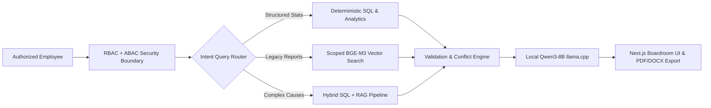

# 🏆 GeoVault AI — SIH 2026 Judge Demonstration Script
**Smart India Hackathon 2026 — Problem Statement 26023**  
*AI-Powered Geological, Mining and Other Reporting Solution for CMPDI/CIL Subsidiaries*

---

## Executive Summary for Judges
GeoVault AI is **not a generic chatbot**. It is a **permission-aware, evidence-grounded, organization-controlled AI intelligence and reporting platform** engineered specifically for the Coal India Limited (CIL) and Central Mine Planning & Design Institute (CMPDI) operational ecosystem.

### Core Architectural Mandates:
1. **`AUTHORIZATION BEFORE RETRIEVAL`**: Security is enforced at the database and retrieval layer. The LLM is never the security boundary; unauthorized records never enter vector search, aggregation engines, or prompt contexts.
2. **`Python calculates. LLM explains.`**: All numerical aggregations, variances, achievements, and trends are computed deterministically in Python/SQL. The LLM only narrates verified facts.
3. **`No-Guess Policy & Conflict Detection`**: When records disagree across departments or sources, the system explicitly reports a **CONFLICT** rather than hallucinating or silently choosing a value.
4. **`100% On-Premises Sovereignty`**: Runs fully air-gapped within Docker using local **PostgreSQL 16 + pgvector**, **BAAI/bge-m3** embeddings, and a local **Qwen3-8B GGUF** reasoner via **llama.cpp**. No data ever leaves the organizational perimeter.

---

## Pre-Demo Quick Verification (< 5 Seconds)
Before starting the presentation, run the rapid smoke-test in a terminal to confirm all microservices are live:
```bash
python scripts/smoke_test_demo.py
```
*Expected Output*: `>>> CERTIFICATION SUCCESS: ALL SMOKE TESTS PASSED IN ~2.3s! <<<`

Open the web application in any modern browser:
* **Web Application Dashboard**: [http://localhost:3000](http://localhost:3000)
* **Interactive FastAPI Documentation**: [http://localhost:8000/docs](http://localhost:8000/docs)

---

## 5 Impressive Demonstration Scenarios



---

### Scenario 1: Parliamentary / Statutory Inquiry (Deterministic Operational SQL)
> **Goal**: Demonstrate zero hallucination on critical government metrics, exact arithmetic calculations, and verifiable citation tracking.

1. In the Top Header, ensure the Demo Identity is set to **`USR001` (Mining Engineer · Dharani East · INTERNAL)**.
2. Navigate to **Ask GeoVault** (`/ask`) on the sidebar.
3. In the query box, enter the parliamentary-style question:
   ```text
   What was the annual coal production of Dharani East Opencast Mine (DEOM-01) from FY2021 to FY2025, and did it meet its statutory target?
   ```
4. Click **Send** or press `Enter`.
5. **What to Point Out to Judges**:
   * **Staged Progress Bar**: Notice the live stage indicator and elapsed timer detailing the exact local inference steps.
   * **Route Badge**: The query router automatically classified the request as **`ROUTE: SQL`**.
   * **Mathematical Accuracy**:
     * 5-Year Production Total: **23.69 MT** against **24.30 MT** statutory target.
     * Target Achievement: **97.49%** (with -0.61 MT overall variance).
     * Python calculated these numbers deterministically; Qwen only narrated the result.
   * **Verifiable Evidence Citation Card**: Click on the evidence card below the answer (`EV-PROD-DEOM-01-2024`). Show that every single figure links to the underlying SQL row and physical CSV record.
   * **Validation Badge**: **`VERIFIED EVIDENCE`** confirms math checks passed with zero discrepancy.

---

### Scenario 2: Root-Cause Investigation & Multi-Hop Reasoning (Hybrid Intelligence)
> **Goal**: Show how GeoVault AI seamlessly bridges structured numerical data with un-indexed legacy departmental memos to explain operational anomalies.

1. Remaining as **`USR001`**, submit the root-cause inquiry:
   ```text
   Why did production decline at Dharani East Mine in FY2022?
   ```
2. **What to Point Out to Judges**:
   * **Route Badge**: Automatically identified as **`ROUTE: HYBRID`** (combining SQL production metrics with RAG legacy document retrieval).
   * **The Explanation**: The system identifies that production dropped to **4.21 MT** in FY2022 against a 4.80 MT target (87.71% achievement).
   * **The Unstructured Evidence Link**: The system surfaces the root cause directly from the archived departmental memo:
     * *Source*: `DEOM-01_2022_monsoon_issue.pdf — Page 1`
     * *Fact*: Severe monsoon flooding in the western pit restricted access to two working benches for 24 production days, prompting emergency sump enlargement and daily dewatering protocols.
   * **Traceability**: Zero guesswork or external speculation; every claim is backed by a clickable citation card.

---

### Scenario 3: Cross-Source Conflict Detection & Discrepancy Auditing
> **Goal**: Prove that GeoVault AI never conceals data discrepancies across organizational silos.

1. Switch user in the Header to **`USR005` (Administrator · HQ · CONFIDENTIAL)** to access enterprise-wide scope.
2. Navigate to **Evidence & Conflicts** (`/evidence`) on the sidebar.
3. Direct the judges' attention to **`CONF-SSOP03-2025-LOGISTICS`**:
   * **Source A (Dispatch Database)**: Records dispatch as *3.92 MT* against *4.00 MT* production (Gap: 0.08 MT) with status categorized as *"Normal"*.
   * **Source B (Legacy Operational Memo `SSOP-03_2025_logistics.pdf`)**: States severe rail siding congestion and siding expansion delays created a **0.31 MT backlog**, forcing emergency road transport diversion.
4. **What to Point Out to Judges**:
   * GeoVault AI **does not silently overwrite or average** these conflicting figures.
   * A high-visibility crimson **CONFLICT DETECTED** banner is surfaced with a statutory notice: *"Discrepancy requires human engineering and logistics review under CIL compliance protocols."*

---

### Scenario 4: Enterprise Cross-Mine Benchmarking & Mandatory ABAC Scope Defense
> **Goal**: Demonstrate how the centralized AuthorizationService strictly blocks cross-mine data leakage and unauthorized LLM access.

#### Part A: Permitted Multi-Mine Manager View
1. Switch user to **`USR004` (Mine Manager · DEOM-01 & KNUG-02 · RESTRICTED)**.
2. Navigate to **Dashboard** (`/`).
3. Point out the **Authorized Mines** pill in the header: `DEOM-01, KNUG-02`.
4. Scroll to the **Cross-Mine Comparative Benchmark** section.
5. The interactive Plotly chart automatically benchmarks opencast Dharani East against underground Koyna North across all 5 fiscal years.

#### Part B: Strict Authorization Defense (The Breach Attempt)
1. Switch user back to **`USR001` (Mining Engineer · Dharani East ONLY · INTERNAL)**.
2. Point out that the scope pill updates to show only `DEOM-01`.
3. Navigate to **Ask GeoVault** (`/ask`) and attempt to snoop on Koyna North:
   ```text
   Compare production between DEOM-01 and KNUG-02.
   ```
4. Click **Send**.
5. **What to Point Out to Judges**:
   * The system immediately halts the query with **`HTTP 403 Forbidden`**.
   * A security-first **`Access Restricted`** alert appears:  
     *"Access Denied: User 'USR001' is not authorized to access mine 'KNUG-02'. Authorized mines: ['DEOM-01']."*
   * **Crucial Architectural Point**: The vector search was **never executed**, and **zero data from KNUG-02 ever reached the LLM context or prompt**. The security boundary is enforced *before* retrieval.

---

### Scenario 5: Automated Boardroom Report Generation (DOCX & PDF Export)
> **Goal**: Demonstrate one-click compilation of comprehensive, publication-grade reports containing executive summaries, KPI tables, and Matplotlib visual charts.

1. Switch user to **`USR001`**.
2. Navigate to **Reports** (`/reports`) on the sidebar.
3. Configure the report parameters:
   * **Report Type**: `Comprehensive Performance Report (PERFORMANCE)`
   * **Mine**: `DEOM-01 — Dharani East Opencast Mine`
   * **Period**: `2021` to `2025`
   * **Visual Charts**: Checked
4. Click **Generate Official Report**.
5. Watch the staged progress indicator as it extracts KPIs, compiles Matplotlib high-resolution charts, audits math checks, and prompts local Qwen3-8B for the executive narrative.
6. Once generated:
   * Review the **Report Metadata Card** with report ID (e.g. `REP-20260911-XXXXXX`).
   * Read the **Executive Summary** synthesized from validated facts.
   * Click **Download PDF Report** to download and open the ReportLab-generated PDF.
   * Click **Download Word DOCX** to inspect the fully editable formatted Word document.
7. Show judges that the document includes headers, footers, classification badges, data tables, and embedded trajectory charts ready for the CIL Board of Directors.

---

## Demo Summary Checklist for Judges

| Evaluation Dimension | GeoVault AI Capability Demonstrated | Status |
| :--- | :--- | :---: |
| **Problem Statement 26023** | AI-Powered Geological, Mining and Operational Reporting for CIL/CMPDI | ✅ Complete |
| **Data Integrity** | `Coal Data/` source directory preserved 100% read-only across all 32 files | ✅ Verified |
| **Security Architecture** | Pre-retrieval RBAC + ABAC authorization scoping (403 on breach) | ✅ Verified |
| **Deterministic Precision** | Deterministic calculations in Python/SQL; LLM restricted to explanation | ✅ Verified |
| **Traceability & Citations** | Clickable, deterministic Evidence IDs for all facts and tables | ✅ Verified |
| **Conflict Handling** | Explicit detection and callout of conflicting organizational records | ✅ Verified |
| **Topic Intelligence** | Permission-scoped TF-IDF keyword ranking and high-res Word Cloud | ✅ Verified |
| **Report Generation** | Automated compilation of publication-grade PDF and editable DOCX | ✅ Verified |
| **Deployment Sovereignty** | 100% local, self-contained Docker architecture with zero cloud dependencies | ✅ Verified |
